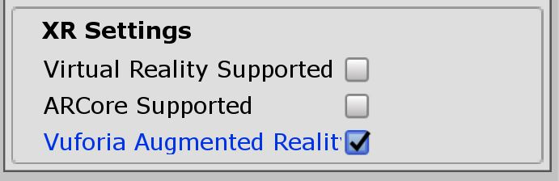

### Poop

## Description
You ask poop. I ask why not. we will try to project a 3D model of poop on top of an image.

## Steps

* Create unity project called Poop and save the Scene
* Activate Vuforia support settings in Player Selecting

* Delete default camera and use AR Camera from game objects.
