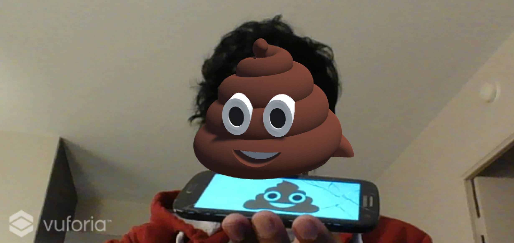
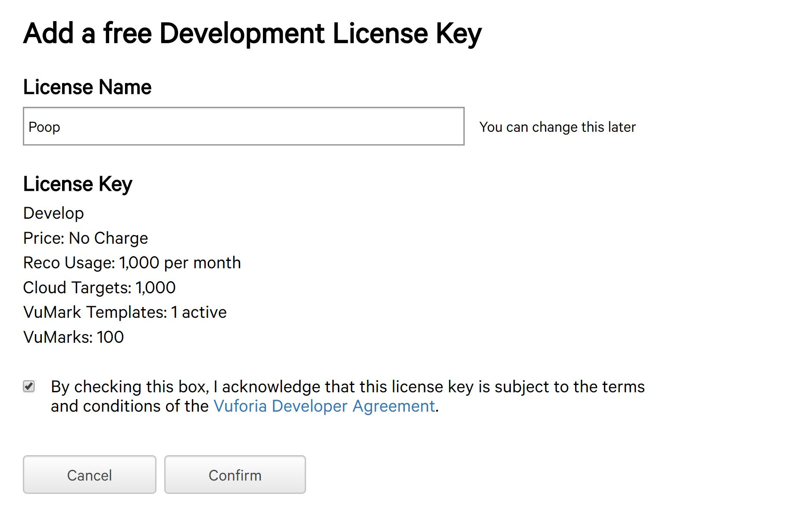

### Poop

## Description
You ask poop. I ask why not. we will try to project a 3D model of poop on top of an image target.

Model: https://sketchfab.com/search?features=downloadable&q=poop&sort_by=-pertinence&type=models

## Steps

* Create unity project called Poop and save the Scene
* Activate Vuforia support settings in Player Selecting

* Delete default camera and use AR Camera from game objects.
* Login Vuforia https://developer.vuforia.com/home-page
* Develop License Key

* Copy License Key and paste in AR Camera vuforia configuration settings
* Upload any image in Vuforia image target. Target Management tab > Add Database
* Open the database and add Target and upload an image
* Download the database as unity option selected.
* Open downloaded database and it will automatically import in unity
* Add Image target in Unity.  Gameobject > vuforia > image
* Add Image target child of AR Camera  
* Find a 3D model and import it in your unity project
* Add model above image target and make the 3D child of image target

we are done. you can export .apk file and install it in your android phone. Unity can also create an package for IOS app but This broke ass student only has an android phone and windows laptop.

Note: Before Building, we need to change the product name and company name and also need to step up sdk paths
